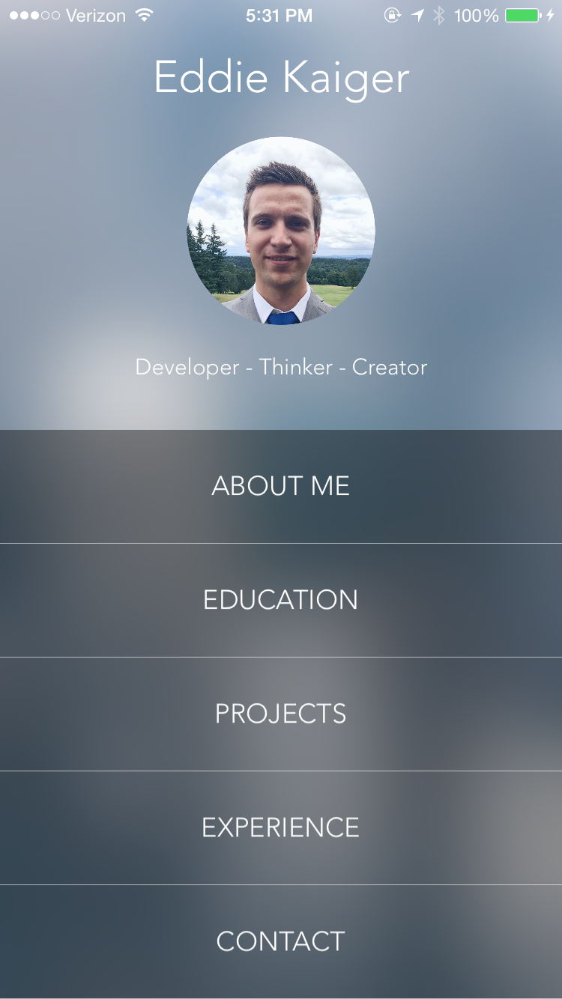
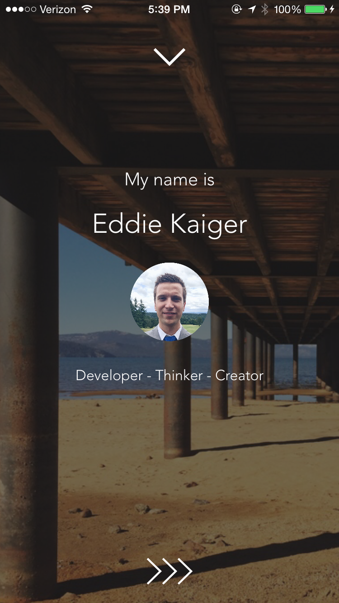
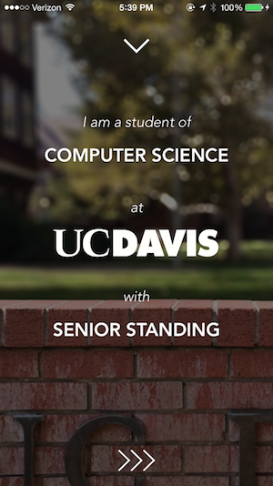
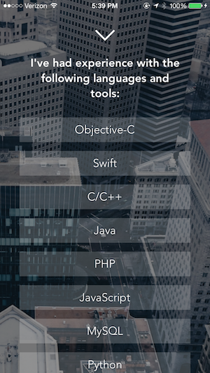

# Portfolio App - WWDC 2015 Scholarship Winner
This is a portfolio iOS app that I built to receive a student scholarship to WWDC 2015. I also now use it as a way to showcase my skills, experience, education, and hobbies.

Below are a few screenshots. Feel free to download and run it on your own device!

